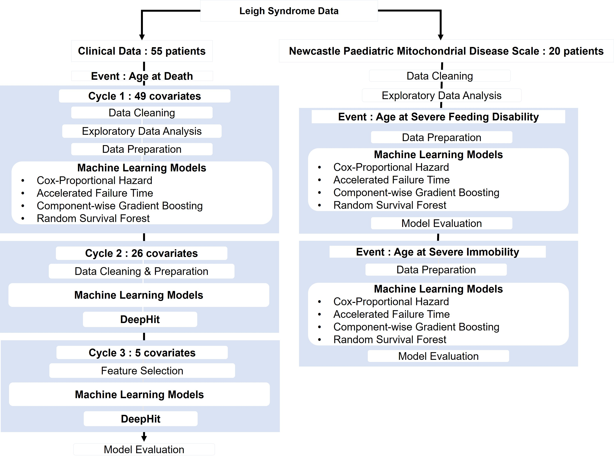

# Predicting Clinical Outcomes for Patients with Leigh Syndrome 

## About
Leigh syndrome is a rare disease that affects the central nervous system of patients arising from abnormalities in the mitochondria. 
The progression of Leigh syndrome is affected many factors making it difficult for clinicians to make an accurate prognosis. 

## Aim
This study aims to provide a prognostic tool to clinicians to predict clinical outcomes and determine relationship between the factors affecting disease progression and clinical outcomes of Leigh syndrome. 
We have listed the following objectives to achieve this aim:
- To build machine learning (ML) models using survival analysis to predict clinical outcomes for patients with Leigh Syndrome 
- To explain the relationship between the features used to train the models with the outcome
- To evaluate the best ML model to predict Leigh Syndrome clinical outcomes 

## Methodology
Four survival analysis machine learning models and a unique deep learning
model, DeepHit is used to train Leigh syndrome data with 55 patients to predict survival
times. The Newcastle Paediatric Mitochondrial Disease Scale data with 20 patients is used to
predict two clinical outcomes, age at feeding inability and immobility using the four machine
learning models.(see more in the [full report](/docs/report.pdf))

## Results
The Cox-proportional hazard model with five features was evaluated as
the best model to predict patient survival. The Cox-proportional hazards model with elastic
net was evaluated as the best model to predict age of patients with feeding inability. Our
novel contribution to Leigh syndrome research using survival analysis machine learning and DeepHit could be used to enhance prognosis of patients (see more in the [report](/report.pdf)). 

## Installation
This project was built in an environment with python 3.7.1

 [**Machine Learning for Leigh Syndrome notebook**](/MachineLearningLeighSyndrome.ipynb)
1. To install essential libraries run `pip install -r requirements.txt`
2. Define the path to data when running the script

 [**DeepHit for Leigh Syndrome notebook**](/DeepHitLeighSyndrome.ipynb)
1. The DeepHit source code needs to be cloned from [DeepHit](https://github.com/chl8856/DeepHit) into the `deephit` folder
3. Define path to data
2. Define path for  ` % run '.py'` statements for DeepHit repo in local drive

## Data 
Anonymised patient data for this study was obtained from Wellcome Centre for Mitochondrial Research, Newcastle. However, the [Leigh Syndrome data](/data/LS_data) is not publicly available.
[WHO weight percentiles data](/data/WHO_data) was used to calculated weight-for-age percentiles according to [child growth standards](https://www.who.int/tools/child-growth-standards/standards/weight-for-age).

## Authors
- Nishaal Ajmera
- Coauthors: Dr Stephen McGough, Dr Amy Vincent, Dr Conol Lawless, Atif Khan 

 
